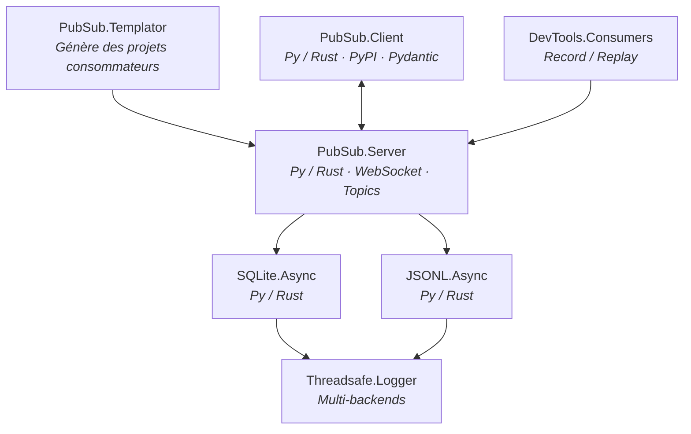

# venantvr.pubsub

Écosystème complet de messaging Pub/Sub temps réel en Python et Rust. Zéro dépendance à un broker externe : WebSocket + SQLite uniquement.

## Repos

### Système Pub/Sub

 public
*Python / Flask / Socket.IO* — Système pub/sub monolithique originel : Flask + Socket.IO + eventlet, persistance SQLite, base du protocole WebSocket temps réel.

 public
*Python / Flask* — Serveur pub/sub standalone extrait du monolithe : gestion de topics, broadcast, persistance SQLite via thread dédié, monitoring intégré, hot-reload de configuration.

 public
*Python* — Client pub/sub publié sur PyPI (`python-pubsub-client`) : reconnexion automatique infinie, queuing de messages, validation Pydantic, handlers typés, dashboard de monitoring HTML intégré.

 public
*Python* — Démo complète multi-topics (orders, inventory, shipping) illustrant l'utilisation du client comme dépendance Git.

### Librairies de support

 public
*Python* — Wrapper SQLite non-bloquant thread-safe publié sur PyPI (`python-sqlite-async`) : écritures dans un thread dédié, zéro dépendance externe.

 public
*Python* — Writer JSONL non-bloquant thread-safe publié sur PyPI (`python-jsonl-queue`) : écriture asynchrone dans des fichiers `.jsonl`, zéro dépendance.

 public
*Python* — Logger métier thread-safe multi-backends (SQLite via `python-sqlite-async` + JSONL via `python-jsonl-queue` + TinyDB), non-bloquant.

 public
*Python* — Proxies génériques record/replay pour DevTools : interception transparente des événements, rejeu configurable.

 public
*Python* — Générateur de squelettes de projets consommateurs : templates YAML-driven (Makefile, Docker Compose, agents, events, tests), scaffolding interactif.

### Ports Rust (haute performance)

 public
*Rust / Axum / Tokio* — Port du serveur : Axum + socketioxide + Tokio, binaire unique optimisé (LTO, strip), purge automatique, feature flags (parallel/sequential emit).

 public
*Rust / Tokio* — Port du client : tokio + rust_socketio + dashmap (lock-free), benchmarks Criterion, reconnexion automatique.

 public
*Rust* — Port du wrapper SQLite : pool r2d2 + rusqlite, canal crossbeam borné pour contre-pression (back-pressure), thread d'écriture dédié.

 public
*Rust* — Port du writer JSONL : batch générique `serde::Serialize`, SmallVec pour éviter les allocations heap, canal crossbeam borné.

## Architecture

## Principes

- **Dual-language** : chaque composant existe en Python et en Rust avec la même API
- **Async-first** : tous les backends de stockage utilisent des threads d'écriture dédiés
- **Thread-safe** : conçu pour les environnements concurrents (dashmap, crossbeam, locks)
- **Self-contained** : aucun broker externe requis (ni RabbitMQ, ni Kafka, ni Redis)
- **PyPI-ready** : client, SQLite.Async et JSONL.Async publiés comme packages installables
